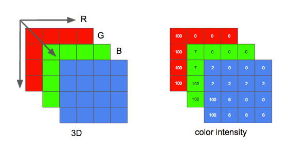
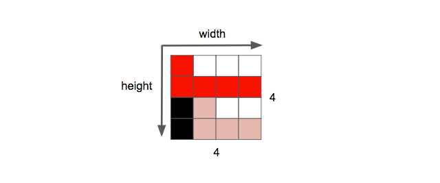
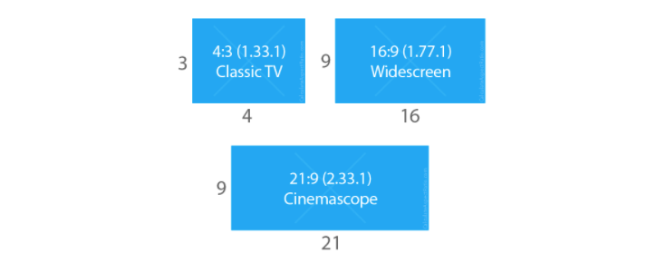
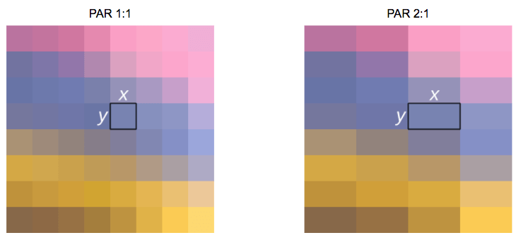

# 理解图像

一个**图像**可以视作一个**二维矩阵**。如果将**色彩**考虑进来，我们可以继续扩展：将这个图像视作一个**三维矩阵**——多出来的维度用于储存色彩信息。

如果我们选择三原色（红、绿、蓝）代表这些色彩，这就定义了三个平面：第一个是红色平面，第二个是绿色平面，最后一个是蓝色平面。

我们把这个矩阵里的每一个点称为**像素**（图像元素）。像素的色彩由三原色的**强度**（通常用数值表示）表示。例如，一个**红色像素**是指强度为 0 的绿色，强度为 0 的蓝色和强度最大的红色。**粉色像素**可以通过三种颜色的组合表示。如果规定强度的取值范围是 0 到 255，**红色 255、绿色 192、蓝色 203** 则表示粉色。

例如以下几张图片。第一张包含所有颜色平面，剩下的分别是红、绿、蓝色平面（显示为灰调。颜色强度高的地方显示为亮色，强度低为暗色。

我们可以看到，对于最终的成像，红色平面对强度的贡献更多（三个平面最亮的是红色平面），蓝色平面（最后一张图片）的贡献大多只在马里奥的眼睛和他衣服的一部分。所有颜色平面对马里奥的胡子（最暗的部分）均贡献较少。

存储颜色的强度，需要占用一定大小的数据空间，这个大小被称为**颜色深度**。假如每个颜色（平面）的强度占用 8 bit（取值范围为 0 到 255），那么颜色深度就是 24（8*3）bit，我们还可以推导出我们可以使用 2 的 24 次方种不同的颜色。

> 还有许多其它模型也可以用来表示色彩，进而组成图像。例如，给每种颜色都标上序号（如下图），这样每个像素仅需一个字节就可以表示出来，而不是 RGB 模型通常所需的 3 个。在这样一个模型里我们可以用一个二维矩阵来代替三维矩阵去表示我们的色彩，这将节省存储空间，但色彩的数量将会受限。
>
> 

图片的另一个属性是**分辨率**，即一个平面内像素的数量。通常表示成宽*高，例如下面这张 **4x4** 的图片。

图像还有一个属性是宽高比，它简单地描述了图像或像素的宽度和高度之间的比例关系。

当人们说这个电影或照片是 16:9 时，通常是指显示宽高比（DAR），然而我们也可以有不同形状的单个像素，我们称为像素宽高比（PAR）。

> 虽然 DVD 的实际分辨率是 704x480，但它依然保持 4:3 的宽高比，因为它有一个 10:11（704x10／480x11）的 PAR。