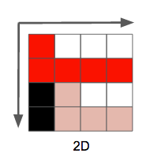
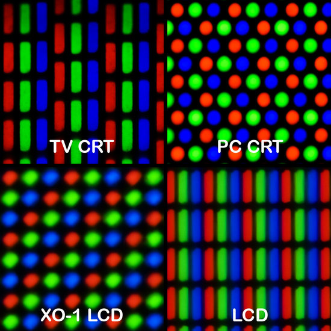

# 理解图像

## 目录

- [基础概念](#基础概念)
  - [颜色模型](#颜色模型)
  - [分辨率](#分辨率)
  - [宽高比](#宽高比)
  - [文件格式](#文件格式)
- [常用的文件类型](#常用的文件类型)
- [选择合适的图像格式](#选择合适的图像格式)
- [使用备选功能](#使用备选功能)

## 基础概念

一个**图像**可以视作一个**二维矩阵**。我们把这个矩阵里的每一个点称之为**像素**（图像元素）。例如下面这幅图中，每一个小的矩阵就是一个像素，由这些 16 个矩阵组成的二维矩阵就是图像：



### 颜色模型

#### RGB

如果将**色彩**考虑进来，我们可以继续扩展：将这个图像视作一个**三维矩阵**——多出来的维度用于储存色彩信息。

如果我们选择三原色（红、绿、蓝）代表这些色彩，这就定义了三个平面：第一个是红色平面，第二个是绿色平面，最后一个是蓝色平面。


像素的色彩由三原色的**强度**（通常用数值表示）表示。例如，一个**红色像素**是指强度为 0 的绿色，强度为 0 的蓝色和强度最大的红色。**粉色像素**可以通过三种颜色的组合表示。如果规定强度的取值范围是 0 到 255，那么 **红色 255、绿色 192、蓝色 203** 则表示粉色。

例如以下几张图片。第一张包含所有颜色平面，剩下的分别是红、绿、蓝色平面（显示为灰调。颜色强度高的地方显示为亮色，强度低为暗色。


我们可以看到，对于最终的成像，红色平面对强度的贡献更多（三个平面最亮的是红色平面），蓝色平面（最后一张图片）的贡献大多只在马里奥的眼睛和他衣服的一部分。所有颜色平面对马里奥的胡子（最暗的部分）均贡献较少。

存储颜色的强度，需要占用一定大小的数据空间，这个大小被称为**颜色深度**。例如在 RGB 中，每个颜色（平面）的强度占用 8 bit（取值范围为 0 到 255），那么其颜色深度就是 24（8*3）bit，我们还可以推导出我们可以使用 2 的 24 次方种不同的颜色。

#### YUV

与 RGB 不同，YUV（或Y'UV）颜色模型是基于人类如何感知彩色图像。它将亮度（光亮）和色度（颜色）分离开，这里讲解其中一种分离模型 —— **YCbCr**<sup>*</sup>。

> <sup>*</sup> 有很多种模型做同样的分离。

这个颜色模型使用 **Y** 来表示亮度，还有两种颜色通道：**Cb（蓝色色度）** 和 **Cr（红色色度）**。YCbCr 可以由 RGB 转换得来，也可以转换回 RGB。使用这个模型我们可以创建拥有完整色彩的图像，如下图。


有人可能会问，在**不使用绿色（色度）** 的情况下，我们如何表现出所有的色彩？

为了回答这个问题，我们将介绍从 RGB 到 YCbCr 的转换。我们将使用 [ITU-R 小组](https://en.wikipedia.org/wiki/ITU-R) 建议的[标准 BT.601](https://en.wikipedia.org/wiki/Rec._601) 中的系数。

第一步是计算亮度，我们将使用 ITU 建议的常量，并替换 RGB 值。

```
Y = 0.299R + 0.587G + 0.114B
```

一旦我们有了亮度后，我们就可以拆分颜色（蓝色色度和红色色度）：

```
Cb = 0.564(B - Y)
Cr = 0.713(R - Y)
```

并且我们也可以使用 YCbCr 转换回来，甚至得到绿色。

```
R = Y + 1.402Cr
B = Y + 1.772Cb
G = Y - 0.344Cb - 0.714Cr
```

通常，**显示屏**（监视器，电视机，屏幕等等）**仅使用 RGB 模型**，并以不同的方式来组织，看看下面这些显示屏的放大效果：



> 还有许多其它模型也可以用来表示色彩，进而组成图像。例如，给每种颜色都标上序号（如下图），这样每个像素仅需一个字节就可以表示出来，而不是 RGB 模型通常所需的 3 个。在这样一个模型里我们可以用一个二维矩阵来代替三维矩阵去表示我们的色彩，这将节省存储空间，但色彩的数量将会受限。
>
> 

### 分辨率

图片的另一个属性是**分辨率**，即一个平面内像素的数量。通常表示成宽*高，例如下面这张 **4x4** 的图片。


### 宽高比

图像还有一个属性是宽高比，它简单地描述了图像或像素的宽度和高度之间的比例关系。

当人们说这个电影或照片是 16:9 时，通常是指显示宽高比（DAR），然而我们也可以有不同形状的单个像素，我们称为像素宽高比（PAR）。


> 虽然 DVD 的实际分辨率是 704x480，但它依然保持 4:3 的宽高比，因为它有一个 10:11（704x10／480x11）的 PAR。

### 文件格式

图像文件格式是记录和存储影像信息的格式。对数字图像进行存储、处理、传播，必须采用一定的图像格式，也就是把图像的像素按照一定的方式进行组织和存储，把图像数据存储成文件就得到图像文件。图像文件格式决定了应该在文件中存放何种类型的信息，文件如何与各种应用软件兼容，文件如何与其它文件交换数据。图像文件格式可以以未压缩格式、压缩格式（可以是无损或有损的）或矢量格式存储数据。

## 常用的文件格式

下面列举了网页上常用的图像文件格式。

<table>
  <thead>
    <tr>
      <th>缩写</th>
      <th>文件格式</th>
      <th>MIME 类型</th>
      <th>文件拓展名</th>
      <th>浏览器兼容性</th>
    </tr>
  </thead>
  <tbody>
    <tr>
      <th><a>APNG</a></th>
      <th>
        Animated Portable Network Graphics<br>
        <strong>动态便携式网络图像</strong>
      </th>
      <td><code>image/apng</code></td>
      <td><code>.apng</code></td>
      <td>Chrome, Edge, Firefox, Opera, Safari</td>
    </tr>
    <tr>
      <th><a>AVIF</a></th>
      <th>
        AV1 Image File Format<br>
        AV1&nbsp;图像文件格式
      </th>
      <td><code>image/avif</code></td>
      <td><code>.avif</code></td>
      <td>Chrome, Opera, Firefox (feature flag)</td>
      </tr>
      <tr>
      <th><a>GIF</a></th>
      <th>
        Graphics Interchange Format<br>
        图像互换格式
      </th>
      <td><code>image/gif</code></td>
      <td><code>.gif</code></td>
      <td>Chrome, Edge, Firefox, Internet Explorer, Opera, Safari</td>
    </tr>
    <tr>
      <th><a>JPEG</a></th>
      <th>
        Joint Photographic Expert Group image<br>
        联合影像专家小组图像
      </th>
      <td><code>image/jpeg</code></td>
      <td><code>.jpg</code>, <code>.jpeg</code>, <code>.jfif</code>, <code>.pjpeg</code>, <code>.pjp</code></td>
      <td>Chrome, Edge, Firefox, Internet Explorer, Opera, Safari</td>
    </tr>
    <tr>
      <th><a>PNG</a></th>
      <th>
        Portable Network Graphics<br>
        <strong>便携式网络图像</strong>
      </th>
      <td><code>image/png</code></td>
      <td><code>.png</code></td>
      <td>Chrome, Edge, Firefox, Internet Explorer, Opera, Safari</td>
    </tr>
    <tr>
      <th><a>SVG</a></th>
      <th>
        Scalable Vector Graphics<br>
        <strong>可缩放矢量图形</strong>
      </th>
      <td><code>image/svg+xml</code></td>
      <td><code>.svg</code></td>
      <td>Chrome, Edge, Firefox, Internet Explorer, Opera, Safari</td>
    </tr>
    <tr>
      <th><a>WebP</a></th>
      <th>
        Web Picture format<br>
        万维网图像格式
      </th>
      <td><code>image/webp</code></td>
      <td><code>.webp</code></td>
      <td>Chrome, Edge, Firefox, Opera, Safari</td>
    </tr>
  </tbody>
</table>

还有一些图像格式，但应避免在网页上，因为它们没有广泛的浏览器支持，或者因为有其他更好的选择。下面这个列表列举了这类图像格式：

<table>
 <thead>
  <tr>
   <th>缩写</th>
   <th>文件格式</th>
   <th>MIME 类型</th>
   <th>文件扩展名</th>
   <th>浏览器兼容性</th>
  </tr>
 </thead>
 <tbody>
  <tr>
   <th><a>BMP</a></th>
   <th>Bitmap file</th>
   <td><code>image/bmp</code></td>
   <td><code>.bmp</code></td>
   <td>Chrome, Edge, Firefox, IE, Opera, Safari</td>
  </tr>
  <tr>
   <th><a>ICO</a></th>
   <th>Microsoft Icon</th>
   <td><code>image/x-icon</code></td>
   <td><code>.ico</code>, <code>.cur</code></td>
   <td>Chrome, Edge, Firefox, IE, Opera, Safari</td>
  </tr>
  <tr>
   <th><a>TIFF</a></th>
   <th>Tagged Image File Format</th>
   <td><code>image/tiff</code></td>
   <td><code>.tif</code>, <code>.tiff</code></td>
   <td>Safari</td>
  </tr>
 </tbody>
</table>

## 选择合适的图像格式

### 照片

照片通常在有损压缩下表现良好。JPEG 和 WebP 格式是照片的理想选择，JPEG 浏览器兼容性更好，但 WebP 可以提供更好的压缩效果。
为了最大程度地提高质量并最大程度地减少下载时间，请考虑使用备选功能：将 WebP 作为第一选择，JPEG 作为第二选择。否则 JPEG 是兼容性的最佳选择。

| 最佳 | 备选 |
| ---- | ---- |
| WebP | JPEG |

### 图标

对于较小的图像，例如图标，请使用无损格式，以避免尺寸受限的图像中细节的丢失。

尽管无损 WebP 是实现此目的理想选择，但支持尚不广泛。因此，除非使用备选功能，否则 PNG 是更好的选择。如果图像包含的颜色少于 256 种颜色，则可以使用 GIF。

如果可以使用矢量图形表示图标，请考虑使用 SVG，因为它可以在各种分辨率和大小上缩放，因此非常适合响应式设计。尽管现代浏览器对 SVG 的支持很好，但还需要考虑为较旧的浏览器使用备选功能将 PNG 作为第二选择。

| 最佳 | 备选 |
| ---- | ---- |
| SVG，无损 WebP 或 PNG | PNG |

### 屏幕截图

除非你愿意在质量上做出妥协，否则应该对屏幕截图使用无损格式。因为如果屏幕快照中有文本，在有损压缩下，文本很容易变得模糊不清。

PNG 可能是最好的选择，但是无损 WebP 可以得到更好的压缩效果。

| 最佳 | 备选 |
| ---- | ---- |
| 无损 WebP 或 PNG | PNG 或 JPEG |
| JPEG，如果不考虑压缩伪影 | GIF 用于较少颜色范围的屏幕截图 |

### 图表

对于可以使用矢量图形表示的任何图像，SVG 是最佳选择。否则，你应该使用无损格式，例如 PNG。如果确实选择有损格式，例如 JPEG 或有损 WebP，请仔细权衡压缩级别，以免导致文本或其他形状变得模糊或不清楚。

| 最佳 | 备选 |
| ---- | ---- |
| SVG | PNG |

## 使用备选功能

虽然 `` 元素不支持图像的兼容性回退，但是 `<picture>` 元素支持。
`<picture>` 用一组 `<source>` 元素的声明需要加载的图像，每个元素指定不同格式或不同媒体条件下的图像版本。还可以用 `` 元素来进行兜底，显示兼容性最好的版本。

例如，下面的代码中用效果最好的 SVG 格式显示的图表，然后用 PNG 或 GIF 作为备选兜底：

```html
<picture>
  <source srcset="diagram.svg" type="image/svg+xml">
  <source srcset="diagram.png" type="image/png">
  
</picture>
```

## 参考资料

- [图像文件类型与格式指南](https://developer.mozilla.org/zh-CN/docs/Web/Media/Formats/Image_types)
- [编码颜色](https://developer.mozilla.org/en-US/docs/Web/Media/Formats/Video_concepts#encoding_color)