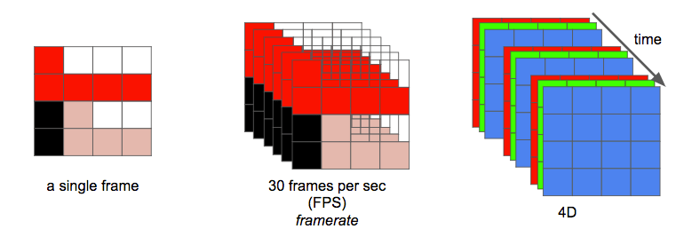
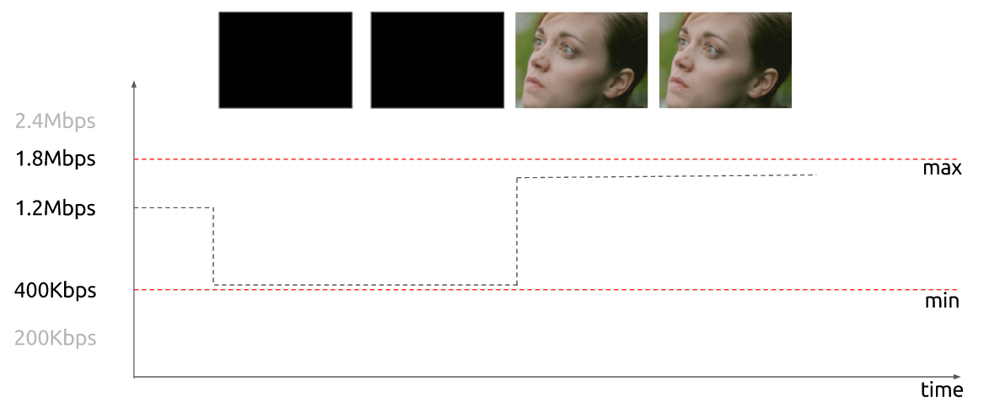
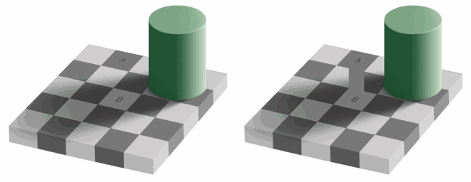
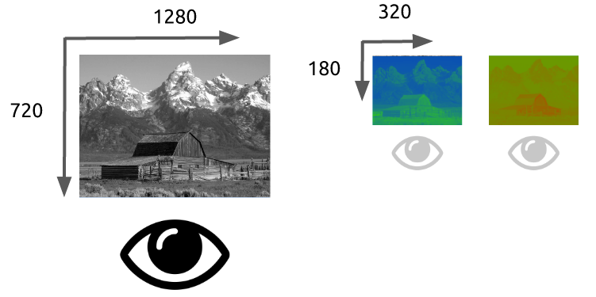
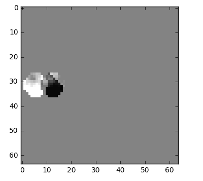
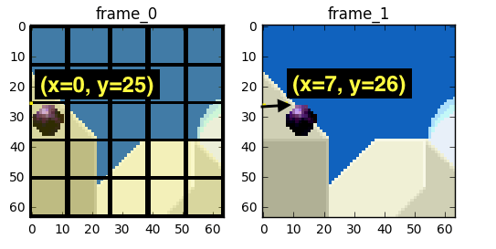
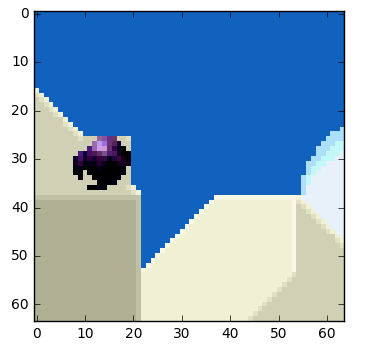
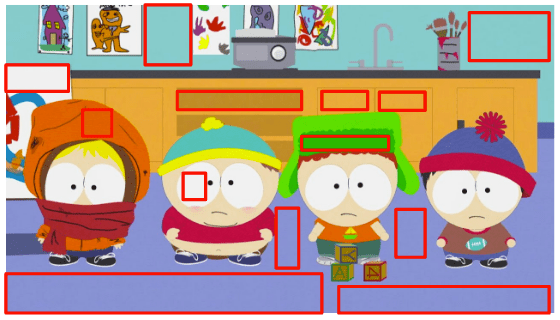

# 理解视频

## 基础概念

我们可以将**视频**定义为在**单位时间**内**连续的 n 个图像**，一个图像我们称之为**一帧**。

这可以视作一个新的维度，n 即为**帧率**，若单位时间为秒，则等同于 FPS (每秒帧数 Frames Per Second)。

播放一段视频每秒所需的数据量就是它的**比特率**（即常说的码率）。

> 比特率 = 宽 * 高 * 颜色深度 * 帧每秒

例如，一段每秒 30 帧，每像素 24 bits，分辨率是 480x240 的视频，如果我们不做任何压缩，它将需要 **82,944,000 比特每秒**或 82.944 Mbps (30x480x240x24)。

当**比特率**几乎恒定时称为恒定比特率（**CBR**）；但它也可以变化，称为可变比特率（**VBR**）。

> 这个图形显示了一个受限的 VBR，当帧为黑色时不会花费太多的数据量。
>
> 

## 消除冗余（压缩）

我们认识到，不对视频进行压缩是不行的；**一个单独的一小时长的视频**，分辨率为 720p 和 30fps 时将**需要 278GB\***。仅仅使用无损数据压缩算法——如 DEFLATE（被PKZIP, Gzip, 和 PNG 使用）——也无法充分减少视频所需的带宽，我们需要找到其它压缩视频的方法。

> *我们使用乘积得出这个数字 1280 x 720 x 24 x 30 x 3600 （宽，高，每像素比特数，fps 和秒数）

为此，我们可以**利用视觉特性**：和区分颜色相比，我们区分亮度要更加敏锐。**时间上的重复**：一段视频包含很多只有一点小小改变的图像。**图像内的重复**：每一帧也包含很多颜色相同或相似的区域。

### 颜色和亮度

我们的眼睛[对亮度比对颜色更敏感](http://vanseodesign.com/web-design/color-luminance/)，你可以看看下面的图片自己测试。

如果你看不出左图的**方块 A 和方块 B** 的颜色是**相同的**，那么好，是我们的大脑玩了一个小把戏，这让我们更多的去注意光与暗，而不是颜色。右边这里有一个使用同样颜色的连接器，那么我们（的大脑）就能轻易分辨出事实，它们是同样的颜色。

一旦我们知道我们对**亮度**（图像中的亮度）更敏感，我们就可以利用它。

#### 色度子采样

一旦我们能从图像中分离出亮度和色度，我们就可以利用人类视觉系统对亮度比色度更敏感的特点，选择性地剔除信息。**色度子采样**是一种编码图像时，使**色度分辨率低于亮度**的技术。

我们应该减少多少色度分辨率呢？已经有一些模式定义了如何处理分辨率和合并（`最终的颜色 = Y + Cb + Cr`）。

这些模式称为子采样系统，并被表示为 3 部分的比率 - `a:x:y`，其定义了色度平面的分辨率，与亮度平面上的、分辨率为 `a x 2` 的小块之间的关系。
* `a` 是水平采样参考 (通常是 4)，
* `x` 是第一行的色度样本数（相对于 a 的水平分辨率），
* `y` 是第二行的色度样本数。

现代编解码器中使用的常用方案是： 4:4:4 (没有子采样), 4:2:2, 4:1:1, 4:2:0, 4:1:0。

<table style="max-width: 46em;">
  <thead>
    <tr>
      <th style="width: 144px;"></th>
      <th style="width: 144px;">4:2:0</th>
      <th style="width: 144px;">4:2:2</th>
      <th style="width: 144px;">4:4:4</th>
    </tr>
  </thead>
  <tbody>
    <tr>
      <th style="width: 144px;">亮度</th>
      <td style="width: 144px; text-align: right;">
        
      </td>
      <td style="width: 144px; text-align: right;">
        
      </td>
      <td style="width: 144px; text-align: right;">
        
      </td>
    </tr>
    <tr>
      <th style="width: 144px;">色度（ U 和 V ）</th>
      <td style="width: 144px; text-align: right;">
        
      </td>
      <td style="width: 144px; text-align: right;">
        
      </td>
      <td style="width: 144px; text-align: right;">
        
      </td>
    </tr>
    <tr>
      <th style="width: 144px;">像素解码</th>
      <td style="width: 144px; text-align: right;">
        
      </td>
      <td style="width: 144px; text-align: right;">
        
      </td>
      <td style="width: 144px; text-align: right;">
        
      </td>
    </tr>
  </tbody>
</table>

下图是同一张图片使用几种主要的色度子采样技术进行编码，第一行图像是最终的 YCbCr，而最后一行图像展示了色度的分辨率。这么小的损失确实是一个伟大的胜利。

前面我们计算过我们需要 278GB 去存储一个一小时长，分辨率在 720p 和 30fps 的视频文件。如果我们使用 `YCbCr 4:2:0` 我们能剪掉`一半的大小（139GB）`*，但仍然不够理想。

> * 我们通过将宽、高、颜色深度和 fps 相乘得出这个值。前面我们需要 24 bit，现在我们只需要 12 bit。

### 帧类型

现在我们进一步消除`时间冗余`，但在这之前让我们来确定一些基本术语。假设我们一段 30fps 的影片，这是最开始的 4 帧。

   

我们可以在帧内看到**很多重复内容**，如**蓝色背景**，从 0 帧到第 3 帧它都没有变化。为了解决这个问题，我们可以将它们抽象地分类为三种类型的帧。

#### I 帧（帧内编码，关键帧）

I 帧（可参考，关键帧，帧内编码）是一个**自足的帧**。它不依靠任何东西来渲染，I 帧与静态图片相似。第一帧通常是 I 帧，但我们将看到 I 帧被定期插入其它类型的帧之间。

#### P 帧（预测）

P 帧利用了一个事实：当前的画面几乎总能**使用之前的一帧进行渲染**。例如，在第二帧，唯一的改变是球向前移动了。仅仅使用（第二帧）对前一帧的引用和差值，我们就能重建前一帧。

 <-  

#### B 帧（双向预测）

如何引用前面和后面的帧去做更好的压缩？！简单地说 B 帧就是这么做的。

  <-   -> 

#### 小结

这些帧类型用于提供更好的压缩率，我们将在下一章看到这是如何发生的。现在，我们可以想到 I 帧是昂贵的，P 帧是便宜的，最便宜的是 B 帧。

### 时间冗余（帧间预测）

让我们探究去除**时间上的重复**，去除这一类冗余的技术就是**帧间预测**。

我们将尝试花费较少的数据量去编码在时间上连续的 0 号帧和 1 号帧。

我们可以做个减法，我们简单地用 0 号帧减去 1 号帧，得到残差，这样我们就只需要**对残差进行编码**。

但我们有一个更好的方法来节省数据量。首先，我们将`0 号帧` 视为一个个分块的集合，然后我们将尝试将 `帧 1` 和 `帧 0` 上的块相匹配。我们可以将这看作是**运动预测**。

> “运动补偿是一种描述相邻帧（相邻在这里表示在编码关系上相邻，在播放顺序上两帧未必相邻）差别的方法，具体来说是描述前面一帧（相邻在这里表示在编码关系上的前面，在播放顺序上未必在当前帧前面）的每个小块怎样移动到当前帧中的某个位置去。”

我们预计那个球会从 `x=0, y=25` 移动到 `x=6, y=26`，**x** 和 **y** 的值就是**运动向量**。进一步节省数据量的方法是，只编码这两者运动向量的差。所以，最终运动向量就是 `x=6 (6-0), y=1 (26-25)`。

> 实际情况下，这个球会被切成 n 个分区，但处理过程是相同的。

帧上的物体**以三维方式移动**，当球移动到背景时会变小。当我们尝试寻找匹配的块，找不到完美匹配的块是正常的。这是一张运动预测与实际值相叠加的图片。

但我们能看到当我们使用运动预测时，**编码的数据量少于**使用简单的残差帧技术。

### 空间冗余（帧内预测）

如果我们分析一个视频里的每一帧，我们会看到有**许多区域是相互关联的**。

让我们举一个例子。这个场景大部分由蓝色和白色组成。

这是一个 `I 帧`，我们**不能使用前面的帧来预测**，但我们仍然可以压缩它。我们将编码我们选择的那块红色区域。如果我们看看它的周围，我们可以**估计它周围颜色的变化**。

我们预测:帧中的颜色在垂直方向上保持一致，这意味着**未知像素的颜色与临近的像素相同**。

我们的预测会出错，所以我们需要先利用这项技术（**帧内预测**），然后**减去实际值**，算出残差，得出的矩阵比原始数据更容易压缩。

## 编解码

_WIP_

## 视频容器

_WIP_

## 参考资料

- [多媒体容器格式](https://developer.mozilla.org/zh-CN/docs/Web/Media/Formats/Containers)：通用的多媒体容器的优点、局限性以及用法。 
- [视频编解码器指南](https://developer.mozilla.org/zh-CN/docs/Web/Media/Formats/%E8%A7%86%E9%A2%91%E7%BC%96%E8%A7%A3%E7%A0%81%E5%99%A8)：提供有关主要浏览器支持的视频编解码器的基本信息，以及一些不普遍支持但仍可能会遇到的视频编解码器。还涵盖了编解码器功能，优势，限制以及浏览器支持级别和限制相关内容。