# 理解视频

## 基础概念

我们可以将**视频**定义为在**单位时间**内**连续的 n 个图像**，一个图像我们称之为**一帧**。

这可以视作一个新的维度，n 即为**帧率**，若单位时间为秒，则等同于 FPS (每秒帧数 Frames Per Second)。

播放一段视频每秒所需的数据量就是它的**比特率**（即常说的码率）。

> 比特率 = 宽 * 高 * 颜色深度 * 帧每秒

例如，一段每秒 30 帧，每像素 24 bits，分辨率是 480x240 的视频，如果我们不做任何压缩，它将需要 **82,944,000 比特每秒**或 82.944 Mbps (30x480x240x24)。

当**比特率**几乎恒定时称为恒定比特率（**CBR**）；但它也可以变化，称为可变比特率（**VBR**）。

> 这个图形显示了一个受限的 VBR，当帧为黑色时不会花费太多的数据量。
>
> 

## 消除冗余（压缩）

我们认识到，不对视频进行压缩是不行的；**一个单独的一小时长的视频**，分辨率为 720p 和 30fps 时将**需要 278GB\***。仅仅使用无损数据压缩算法——如 DEFLATE（被PKZIP, Gzip, 和 PNG 使用）——也无法充分减少视频所需的带宽，我们需要找到其它压缩视频的方法。

> *我们使用乘积得出这个数字 1280 x 720 x 24 x 30 x 3600 （宽，高，每像素比特数，fps 和秒数）

为此，我们可以**利用视觉特性**：和区分颜色相比，我们区分亮度要更加敏锐。**时间上的重复**：一段视频包含很多只有一点小小改变的图像。**图像内的重复**：每一帧也包含很多颜色相同或相似的区域。

### 颜色和亮度

我们的眼睛[对亮度比对颜色更敏感](http://vanseodesign.com/web-design/color-luminance/)，你可以看看下面的图片自己测试。

如果你看不出左图的**方块 A 和方块 B** 的颜色是**相同的**，那么好，是我们的大脑玩了一个小把戏，这让我们更多的去注意光与暗，而不是颜色。右边这里有一个使用同样颜色的连接器，那么我们（的大脑）就能轻易分辨出事实，它们是同样的颜色。

一旦我们知道我们对**亮度**（图像中的亮度）更敏感，我们就可以利用它。

#### 色度子采样

一旦我们能从图像中分离出亮度和色度，我们就可以利用人类视觉系统对亮度比色度更敏感的特点，选择性地剔除信息。**色度子采样**是一种编码图像时，使**色度分辨率低于亮度**的技术。

我们应该减少多少色度分辨率呢？已经有一些模式定义了如何处理分辨率和合并（`最终的颜色 = Y + Cb + Cr`）。

这些模式称为子采样系统，并被表示为 3 部分的比率 - `a:x:y`，其定义了色度平面的分辨率，与亮度平面上的、分辨率为 `a x 2` 的小块之间的关系。
* `a` 是水平采样参考 (通常是 4)，
* `x` 是第一行的色度样本数（相对于 a 的水平分辨率），
* `y` 是第二行的色度样本数。

现代编解码器中使用的常用方案是： 4:4:4 (没有子采样), 4:2:2, 4:1:1, 4:2:0, 4:1:0。

<table style="max-width: 46em;">
  <thead>
    <tr>
      <th style="width: 144px;"></th>
      <th style="width: 144px;">4:2:0</th>
      <th style="width: 144px;">4:2:2</th>
      <th style="width: 144px;">4:4:4</th>
    </tr>
  </thead>
  <tbody>
    <tr>
      <th style="width: 144px;">亮度</th>
      <td style="width: 144px; text-align: right;">
        
      </td>
      <td style="width: 144px; text-align: right;">
        
      </td>
      <td style="width: 144px; text-align: right;">
        
      </td>
    </tr>
    <tr>
      <th style="width: 144px;">色度（ U 和 V ）</th>
      <td style="width: 144px; text-align: right;">
        
      </td>
      <td style="width: 144px; text-align: right;">
        
      </td>
      <td style="width: 144px; text-align: right;">
        
      </td>
    </tr>
    <tr>
      <th style="width: 144px;">像素解码</th>
      <td style="width: 144px; text-align: right;">
        
      </td>
      <td style="width: 144px; text-align: right;">
        
      </td>
      <td style="width: 144px; text-align: right;">
        
      </td>
    </tr>
  </tbody>
</table>

下图是同一张图片使用几种主要的色度子采样技术进行编码，第一行图像是最终的 YCbCr，而最后一行图像展示了色度的分辨率。这么小的损失确实是一个伟大的胜利。

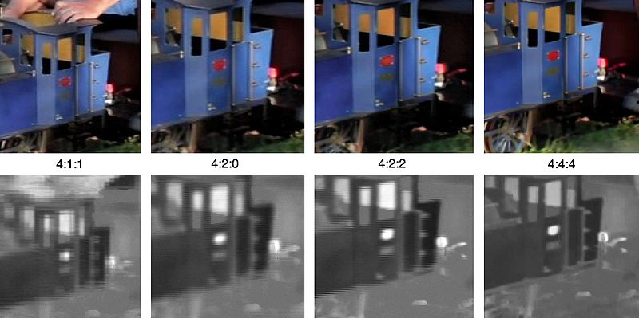

前面我们计算过我们需要 278GB 去存储一个一小时长，分辨率在 720p 和 30fps 的视频文件。如果我们使用 `YCbCr 4:2:0` 我们能剪掉`一半的大小（139GB）`*，但仍然不够理想。

> * 我们通过将宽、高、颜色深度和 fps 相乘得出这个值。前面我们需要 24 bit，现在我们只需要 12 bit。

### 帧类型

现在我们进一步消除`时间冗余`，但在这之前让我们来确定一些基本术语。假设我们一段 30fps 的影片，这是最开始的 4 帧。

   

我们可以在帧内看到**很多重复内容**，如**蓝色背景**，从 0 帧到第 3 帧它都没有变化。为了解决这个问题，我们可以将它们抽象地分类为三种类型的帧。

#### I 帧（帧内编码，关键帧）

I 帧（可参考，关键帧，帧内编码）是一个**自足的帧**。它不依靠任何东西来渲染，I 帧与静态图片相似。第一帧通常是 I 帧，但我们将看到 I 帧被定期插入其它类型的帧之间。

#### P 帧（预测）

P 帧利用了一个事实：当前的画面几乎总能**使用之前的一帧进行渲染**。例如，在第二帧，唯一的改变是球向前移动了。仅仅使用（第二帧）对前一帧的引用和差值，我们就能重建前一帧。

 <-  

#### B 帧（双向预测）

如何引用前面和后面的帧去做更好的压缩？！简单地说 B 帧就是这么做的。

  <-   -> 

#### 小结

这些帧类型用于提供更好的压缩率，我们将在下一章看到这是如何发生的。现在，我们可以想到 I 帧是昂贵的，P 帧是便宜的，最便宜的是 B 帧。

### 时间冗余（帧间预测）

让我们探究去除**时间上的重复**，去除这一类冗余的技术就是**帧间预测**。

我们将尝试花费较少的数据量去编码在时间上连续的 0 号帧和 1 号帧。

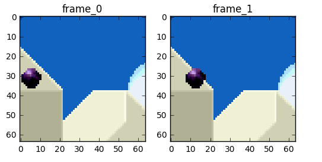

我们可以做个减法，我们简单地用 0 号帧减去 1 号帧，得到残差，这样我们就只需要**对残差进行编码**。

但我们有一个更好的方法来节省数据量。首先，我们将`0 号帧` 视为一个个分块的集合，然后我们将尝试将 `帧 1` 和 `帧 0` 上的块相匹配。我们可以将这看作是**运动预测**。

> “运动补偿是一种描述相邻帧（相邻在这里表示在编码关系上相邻，在播放顺序上两帧未必相邻）差别的方法，具体来说是描述前面一帧（相邻在这里表示在编码关系上的前面，在播放顺序上未必在当前帧前面）的每个小块怎样移动到当前帧中的某个位置去。”

我们预计那个球会从 `x=0, y=25` 移动到 `x=6, y=26`，**x** 和 **y** 的值就是**运动向量**。进一步节省数据量的方法是，只编码这两者运动向量的差。所以，最终运动向量就是 `x=6 (6-0), y=1 (26-25)`。

> 实际情况下，这个球会被切成 n 个分区，但处理过程是相同的。

帧上的物体**以三维方式移动**，当球移动到背景时会变小。当我们尝试寻找匹配的块，找不到完美匹配的块是正常的。这是一张运动预测与实际值相叠加的图片。

但我们能看到当我们使用运动预测时，**编码的数据量少于**使用简单的残差帧技术。

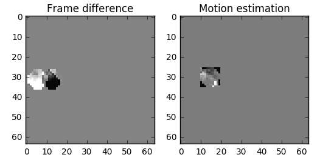

### 空间冗余（帧内预测）

如果我们分析一个视频里的每一帧，我们会看到有**许多区域是相互关联的**。

让我们举一个例子。这个场景大部分由蓝色和白色组成。

这是一个 `I 帧`，我们**不能使用前面的帧来预测**，但我们仍然可以压缩它。我们将编码我们选择的那块红色区域。如果我们看看它的周围，我们可以**估计它周围颜色的变化**。

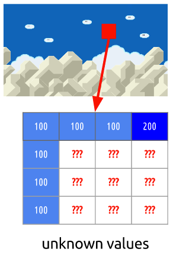

我们预测:帧中的颜色在垂直方向上保持一致，这意味着**未知像素的颜色与临近的像素相同**。

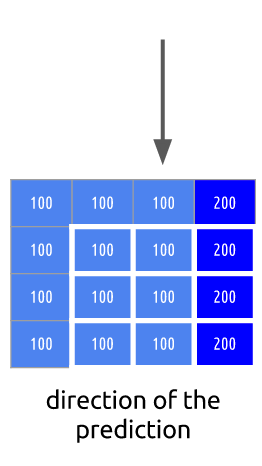

我们的预测会出错，所以我们需要先利用这项技术（**帧内预测**），然后**减去实际值**，算出残差，得出的矩阵比原始数据更容易压缩。

### 副作用

_WIP_

## 编解码器

### 是什么？为什么？怎么做？

- **是什么？** 就是用于压缩或解压数字视频的软件或硬件。
- **为什么？** 人们需要在有限带宽或存储空间下提高视频的质量。还记得当我们计算每秒 30 帧，每像素 24 bit，分辨率是 480x240 的视频需要多少带宽吗？没有压缩时是 **82.944 Mbps**。电视或互联网提供 HD/FullHD/4K 只能靠视频编解码器。
- **怎么做？** 接下来将介绍**通用视频编解码器背后的主要机制**，大多数概念都很实用，并被现代编解码器如 VP9, AV1 和 HEVC 使用。注意：我们将简化许多内容，我们还会使用真实的例子（主要是 H.264）来演示这些技术。

#### 第一步 - 图片分区

第一步是将**帧**分成几个**分区**，**子分区**甚至更多。

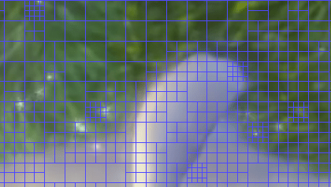

但是为什么呢？有许多原因，比如，当我们分割图片时，我们可以更精确的处理预测，在微小移动的部分使用较小的分区，而在静态背景上使用较大的分区。

通常，编解码器将这些分区组织成切片（或瓦片），宏（或编码树单元）和许多子分区。这些分区的最大大小有所不同，HEVC 设置成 64x64，而 AVC 使用 16x16，但子分区可以达到 4x4 的大小。

还记得我们学过的**帧的分类**吗？你也可以**把这些概念应用到块**，因此我们可以有 I 切片，B 切片，I 宏块等等。

#### 第二步 - 预测

一旦我们有了分区，我们就可以在它们之上做出预测。对于帧间预测，我们需要**发送运动向量和残差**；至于帧内预测，我们需要**发送预测方向和残差**。

#### 第三步 - 转换

在我们得到残差块（`预测分区-真实分区`）之后，我们可以用一种方式**变换**它，这样我们就知道**哪些像素我们应该丢弃**，还依然能保持整体质量。这个确切的行为有几种变换方式。

尽管有[其它的变换方式](https://en.wikipedia.org/wiki/List_of_Fourier-related_transforms#Discrete_transforms)，但我们重点关注离散余弦变换（[DCT](https://en.wikipedia.org/wiki/Discrete_cosine_transform)）。它的主要功能有：

*	将**像素**块**转换**为相同大小的**频率系数块**。
*	**压缩**能量，更容易消除空间冗余。
*	**可逆的**，也意味着你可以还原回像素。

> 2017 年 2 月 2 号，F. M. Bayer 和 R. J. Cintra 发表了他们的论文：[图像压缩的 DCT 类变换只需要 14 个加法](https://arxiv.org/abs/1702.00817)。

如果你不理解每个要点的好处，不用担心，我们会尝试进行一些实验，以便从中看到真正的价值。

我们来看下面的**像素块**（8x8）：

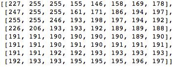

下面是其渲染的块图像（8x8）：

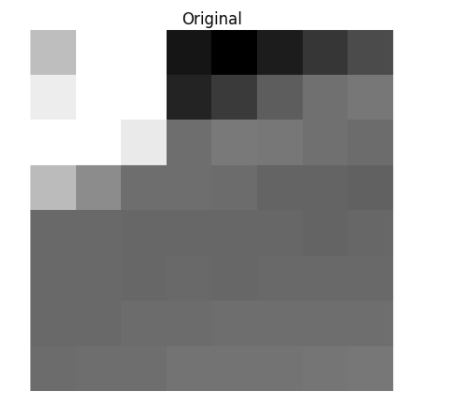

当我们对这个像素块**应用 DCT** 时， 得到如下**系数块**（8x8）：

接着如果我们渲染这个系数块，就会得到这张图片：

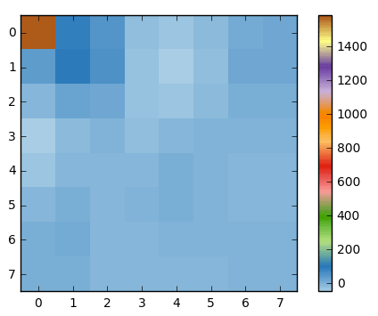

如你所见它看起来完全不像原图像，我们可能会注意到**第一个系数**与其它系数非常不同。第一个系数被称为直流分量，代表了输入数组中的**所有样本**，有点**类似于平均值**。

这个系数块有一个有趣的属性：高频部分和低频部分是分离的。

在一张图像中，**大多数能量**会集中在[低频部分](https://www.iem.thm.de/telekom-labor/zinke/mk/mpeg2beg/whatisit.htm)，所以如果我们将图像转换成频率系数，并**丢掉高频系数**，我们就能**减少描述图像所需的数据量**，而不会牺牲太多的图像质量。

让我们通过实验学习这点，我们将使用 DCT 把原始图像转换为频率（系数块），然后丢掉最不重要的系数。

首先，我们将它转换为其**频域**。

然后我们丢弃部分（67%）系数，主要是它的右下角部分。

然后我们从丢弃的系数块重构图像（记住，这需要可逆），并与原始图像相比较。

如我们所见它酷似原始图像，但它引入了许多与原来的不同，我们**丢弃了67.1875%**，但我们仍然得到至少类似于原来的东西。我们可以更加智能的丢弃系数去得到更好的图像质量。

#### 第四步 - 量化

当我们丢弃一些系数时，在最后一步（变换），我们做了一些形式的量化。这一步，我们选择性地剔除信息（**有损部分**）或者简单来说，我们将**量化系数以实现压缩**。

我们如何量化一个系数块？一个简单的方法是均匀量化，我们取一个块并**将其除以单个的值**（10），并舍入值。

我们如何**逆转**（重新量化）这个系数块？我们可以通过**乘以我们先前除以的相同的值**（10）来做到。

这不是最好的方法，因为它没有考虑到每个系数的重要性，我们可以使用一个**量化矩阵**来代替单个值，这个矩阵可以利用 DCT 的属性，多量化右下部，而少（量化）左上部，[JPEG 使用了类似的方法](https://www.hdm-stuttgart.de/~maucher/Python/MMCodecs/html/jpegUpToQuant.html)。

#### 第五步 - 熵编码

在我们量化数据（图像块／切片／帧）之后，我们仍然可以以无损的方式来压缩它。有许多方法（算法）可用来压缩数据。我们将简单体验其中几个。

##### VLC 编码：

让我们假设我们有一个符号流：**a**, **e**, **r** 和 **t**，它们的概率（从0到1）由下表所示。

|     | a   | e   | r    | t   |
|-----|-----|-----|------|-----|
| 概率 | 0.3 | 0.3 | 0.2 |  0.2 |

我们可以分配不同的二进制码，最好是小的码给最可能出现的字符，大些的码给最少可能出现的字符。

|        | a   | e   | r    | t   |
|--------|-----|-----|------|-----|
|   概率  | 0.3 | 0.3 | 0.2 | 0.2 |
| 二进制码 | 0 | 10 | 110 | 1110 |

让我们压缩 **eat** 流，假设我们为每个字符花费 8 bit，在没有做任何压缩时我们将花费 **24 bit**。但是在这种情况下，我们使用各自的代码来替换每个字符，我们就能节省空间。

第一步是编码字符 **e** 为 `10`，第二个字符是 **a**，追加（不是数学加法）后是 `[10][0]`，最后是第三个字符 **t**，最终组成已压缩的比特流 `[10][0][1110]` 或 `1001110`，这只需 **7 bit**（比原来的空间少 3.4 倍）。

请注意每个代码必须是唯一的前缀码，[Huffman 能帮你找到这些数字](https://en.wikipedia.org/wiki/Huffman_coding)。虽然它有一些问题，但是[视频编解码器仍然提供该方法](https://en.wikipedia.org/wiki/Context-adaptive_variable-length_coding)，它也是很多应用程序的压缩算法。

编码器和解码器都必须知道这个（包含编码的）字符表，因此你也需要传送这个表。

##### 算术编码

让我们假设我们有一个符号流：**a**, **e**, **r**, **s** 和 **t**，它们的概率由下表所示。

|     | a   | e   | r    | s    | t   |
|-----|-----|-----|------|------|-----|
| 概率 | 0.3 | 0.3 | 0.15 | 0.05 | 0.2 |

考虑到这个表，我们可以构建一个区间，区间包含了所有可能的字符，字符按出现概率排序。

让我们编码 **eat** 流，我们选择第一个字符 **e** 位于 **0.3 到 0.6** （但不包括 0.6）的子区间，我们选择这个子区间，按照之前同等的比例再次分割。

让我们继续编码我们的流 **eat**，现在使第二个 **a** 字符位于 **0.3 到 0.39** 的区间里，接着再次用同样的方法编码最后的字符 **t**，得到最后的子区间 **0.354 到 0.372**。

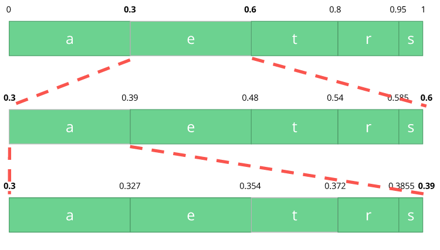

我们只需从最后的子区间 0.354 到 0.372 里选择一个数，让我们选择 0.36，不过我们可以选择这个子区间里的任何数。仅靠这个数，我们将可以恢复原始流 **eat**。就像我们在区间的区间里画了一根线来编码我们的流。

**反向过程**（又名解码）一样简单，用数字 **0.36** 和我们原始区间，我们可以进行同样的操作，不过现在是使用这个数字来还原被编码的流。

在第一个区间，我们发现数字落入了一个子区间，因此，这个子区间是我们的第一个字符，现在我们再次切分这个子区间，像之前一样做同样的过程。我们会注意到 **0.36** 落入了 **a** 的区间，然后我们重复这一过程直到得到最后一个字符 **t**（形成我们原始编码过的流 eat）。

编码器和解码器都**必须知道**字符概率表，因此，你也需要传送这个表。

一些[视频编解码器使用](https://en.wikipedia.org/wiki/Context-adaptive_binary_arithmetic_coding)这项技术（或至少提供这一选择）。

关于无损压缩量化比特流的办法，这里缺少了很多细节、原因、权衡等等。作为一个开发者你[可以学习更多内容](https://www.amazon.com/Understanding-Compression-Data-Modern-Developers/dp/1491961538/)。刚入门视频编码的人可以尝试使用不同的[熵编码算法，如ANS](https://en.wikipedia.org/wiki/Asymmetric_Numeral_Systems)。
#### 第六步 - 比特流格式

完成所有这些步之后，我们需要将**压缩过的帧和内容打包进去**。需要明确告知解码器**编码定义**，如颜色深度，颜色空间，分辨率，预测信息（运动向量，帧内预测方向），配置，层级，帧率，帧类型，帧号等等更多信息。

我们将简单地学习 H.264 比特流。我们使用下面的图片作为帧，生成一个具有**单个帧**，64x64 和颜色空间为 yuv420 的原始 h264 比特流。

AVC (H.264) 标准规定信息将在宏帧（网络概念上的）内传输，称为 [NAL](https://en.wikipedia.org/wiki/Network_Abstraction_Layer)（网络抽象层）。NAL 的主要目标是提供“网络友好”的视频呈现方式，该标准必须适用于电视（基于流），互联网（基于数据包）等。

[同步标记](https://en.wikipedia.org/wiki/Frame_synchronization)用来定义 NAL 单元的边界。每个同步标记的值固定为  `0x00 0x00 0x01` ，最开头的标记例外，它的值是  `0x00 0x00 0x00 0x01` 。如果我们在生成的 h264 比特流上运行 **hexdump**，我们可以在文件的开头识别至少三个 NAL。

解码器需要知道不仅仅是图片数据，还有视频的详细信息，如：帧、颜色、使用的参数等。每个 NAL 的**第一位**定义了其分类和**类型**。

| NAL type id  | 描述  |
|---  |---|
| 0  |  Undefined |
| 1  |  Coded slice of a non-IDR picture |
| 2  |  Coded slice data partition A |
| 3  |  Coded slice data partition B |
| 4  |  Coded slice data partition C |
| 5  |  **IDR** Coded slice of an IDR picture |
| 6  |  **SEI** Supplemental enhancement information |
| 7  |  **SPS** Sequence parameter set |
| 8  |  **PPS** Picture parameter set |
| 9  |  Access unit delimiter |
| 10 |  End of sequence |
| 11 |  End of stream |
| ... |  ... |

通常，比特流的第一个 NAL 是 **SPS**，这个类型的 NAL 负责传达通用编码参数，如**配置，层级，分辨率**等。

如果我们跳过第一个同步标记，就可以通过解码**第一个字节**来了解第一个 **NAL 的类型**。

例如同步标记之后的第一个字节是 `01100111`，第一位（`0`）是 **forbidden_zero_bit** 字段，接下来的两位（`11`）告诉我们是 **nal_ref_idc** 字段，其表示该 NAL 是否是参考字段，其余 5 位（`00111`）告诉我们是 **nal_unit_type** 字段，在这个例子里是 NAL 单元 **SPS** (7)。

SPS NAL 的第 2 位 (`binary=01100100, hex=0x64, dec=100`) 是 **profile_idc** 字段，显示编码器使用的配置，在这个例子里使用的是[受限高配置](https://en.wikipedia.org/wiki/H.264/MPEG-4_AVC#Profiles)，一种没有 B（双向预测） 切片支持的高配置。

如果我们再次使用二进制视图检查我们创建的视频 (ex: `xxd -b -c 11 v/minimal_yuv420.h264`)，可以跳到帧自身上一个 NAL。

我们可以看到最开始的 6 个字节：`01100101 10001000 10000100 00000000 00100001 11111111`。我们已经知道第一个字节告诉我们 NAL 的类型，在这个例子里， (`00101`) 是 **IDR 切片 (5)**，可以进一步检查它：

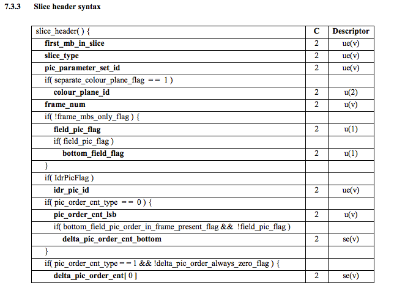

对照规范，我们能解码切片的类型（**slice_type**），帧号（**frame_num**）等重要字段。

为了获得一些字段（`ue(v), me(v), se(v) 或 te(v)`）的值，我们需要称为 [Exponential-Golomb](https://pythonhosted.org/bitstring/exp-golomb.html) 的特定解码器来解码它。当存在很多默认值时，这个方法编码变量值特别高效。

> 示例视频里 **slice_type** 和 **frame_num** 的值是 7（I 切片）和 0（第一帧）。

我们可以将**比特流视为一个协议**，如果你想学习更多关于比特流的内容，请参考 [ITU H.264 规范](http://www.itu.int/rec/T-REC-H.264-201610-I)。这个宏观图展示了图片数据（压缩过的 YUV）所在的位置。

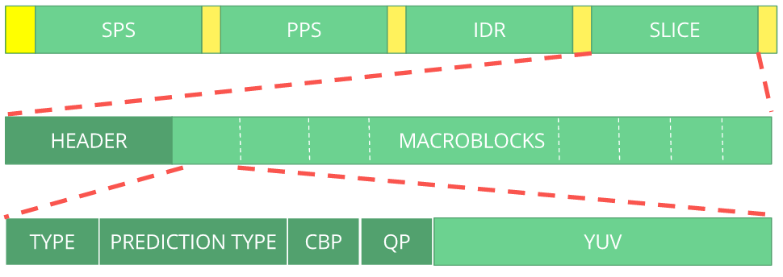

我们可以探究其它比特流，如 [VP9 比特流](https://storage.googleapis.com/downloads.webmproject.org/docs/vp9/vp9-bitstream-specification-v0.6-20160331-draft.pdf)，[H.265（HEVC）](http://handle.itu.int/11.1002/1000/11885-en?locatt=format:pdf)或是新的 [AV1 比特流](https://medium.com/@mbebenita/av1-bitstream-analyzer-d25f1c27072b#.d5a89oxz8)，[他们不相似](http://www.gpac-licensing.com/2016/07/12/vp9-av1-bitstream-format/)，但只要学习了其中之一，学习其他的就简单多了。

### 影响编码的因素

_WIP_

### 通用编解码器

_WIP_

### 选择合适的编码格式

_WIP_

## 视频容器

_WIP_

## 参考资料

- [多媒体容器格式](https://developer.mozilla.org/zh-CN/docs/Web/Media/Formats/Containers)：通用的多媒体容器的优点、局限性以及用法。 
- [视频编解码器指南](https://developer.mozilla.org/zh-CN/docs/Web/Media/Formats/%E8%A7%86%E9%A2%91%E7%BC%96%E8%A7%A3%E7%A0%81%E5%99%A8)：提供有关主要浏览器支持的视频编解码器的基本信息，以及一些不普遍支持但仍可能会遇到的视频编解码器。还涵盖了编解码器功能，优势，限制以及浏览器支持级别和限制相关内容。